## Réseau - révision 1

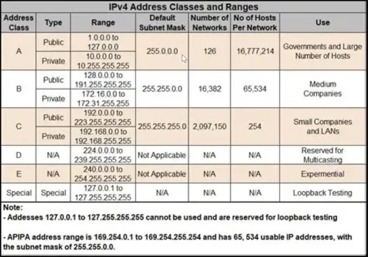

| Mots     | Def |
| -------- | --- |
| Loopback |     |
| Apipa    |     |

## Exo 1

192.168.100.212 /29

On additionne le masque inversé :
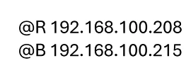
IP:  255.255.255.208 /29
Masque inversé : 0.0.0.7
 192.168.100.215
  
  
- 192.168.100.215 + 192.168.100.208

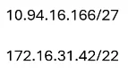

## TCP / UDP

TCP : 
UDP : 

TCP : notion de session. On attends l'acquittement (ACK). Il y a du contrôle. Ralentis le réseau. Nécessaire pour l'authentification, les sessions, et la vérification des téléchargements, entre autres.

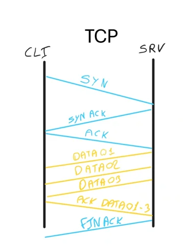

UDP : pas de contrôle, donc plus rapide. Flux continu. Exemple : streaming.

## Modèle OSI

1. Physique
2. Liaison
3. Réseau 
4. Transport
5. Session
6. Présentation
7. Application

## Système

On va créer un script de création de VM sur powershell :

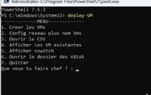

On commence par créer un nouveau switch privé :

Puis une nouvelle VM : 

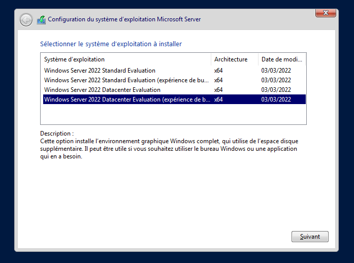

On crée un client qu'on appelle Win10.

Administrateur
P@ssw0rd

user
user

----

On renomme le serveur et on lui met une IP 192.168.10.253

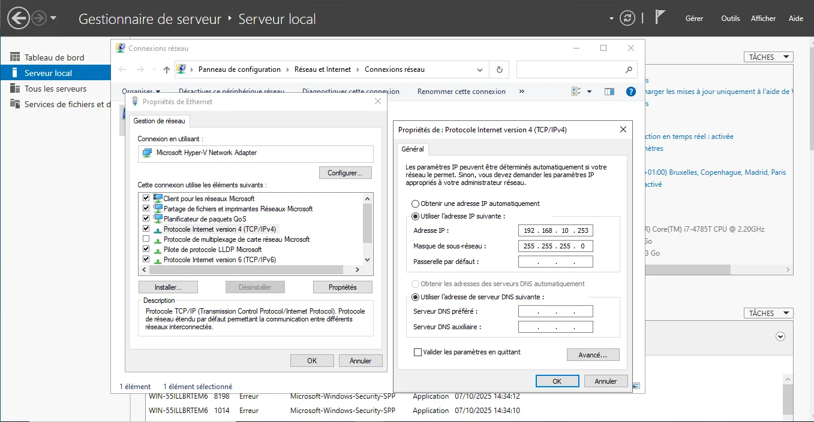

On installe le rôle DHCP

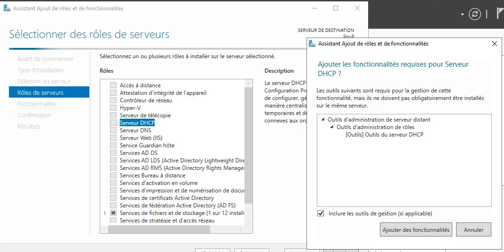

DHCP : distribuer les configurations réseau aux machines du réseau.

On crée une étendue IPv4 : 192.168.10.10 -> 192.168.10.200

**ncpa.cpl**

On se connecte sur le client Windows : 

il récupère bien l'adresse IP : 192.168.10.10

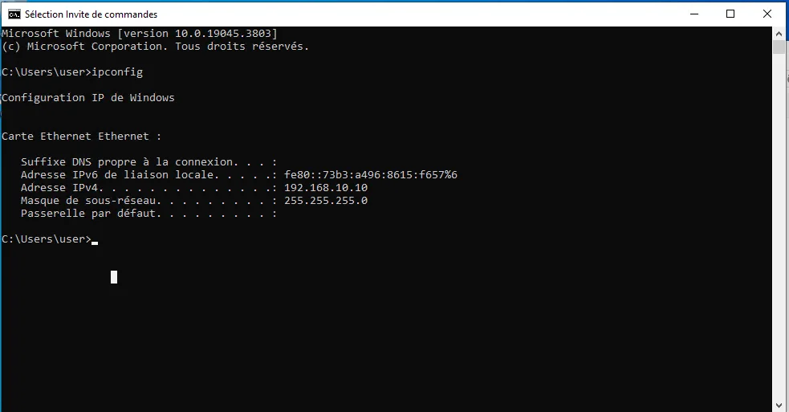

On ouvre le protocole ICMPv4 (ping) sur le serveur et le client : 

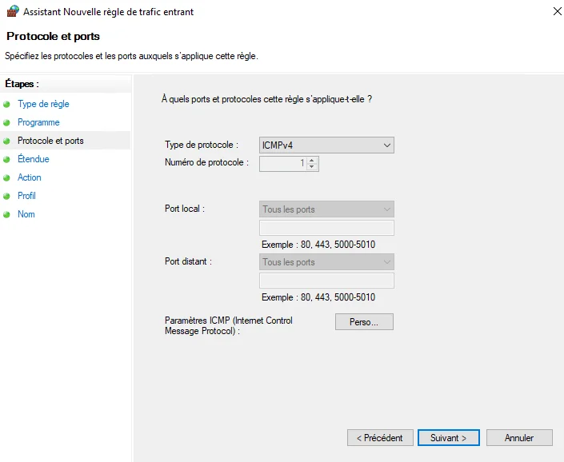

Pare-feu avec fonctions avancées : 
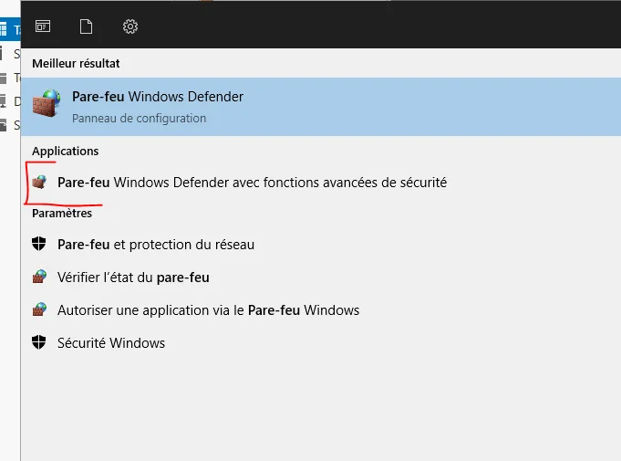

On installe le serveur DNS

Une zone de recherche est là où on crée un nom de domaine.
Primaire : créer une zone
Secondaire : copie d'une zone déjà existante sans pouvoir la modifier. Pratique en cas de multi-site, pour dupliquer la conf et ne pas surcharger l'interco.

NS : nameserver. 
SOA : Détient les droits d'autorité sur la zone. Peut éditer la zone
FQDN : Full Qualified Domain Name

Alias (CNAME) : surnom, redirige vers un NDD.

> [!WARNING] Exam
> NS, SOA, A -> QUESTION DE COURS

On configure les DNS :

 

Mais ça ne fonctionne pas. Pourquoi ? 

On n'a pas configuré l'adresse de loopback sur le serveur : 

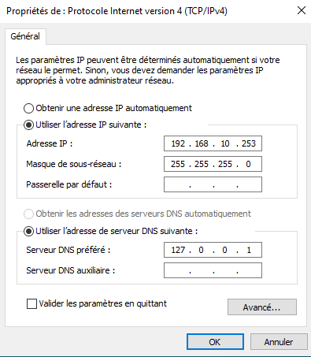

