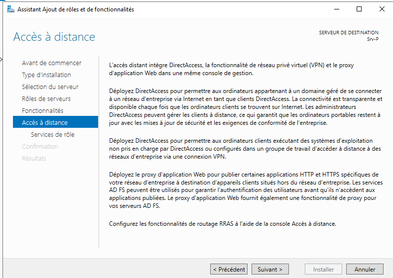
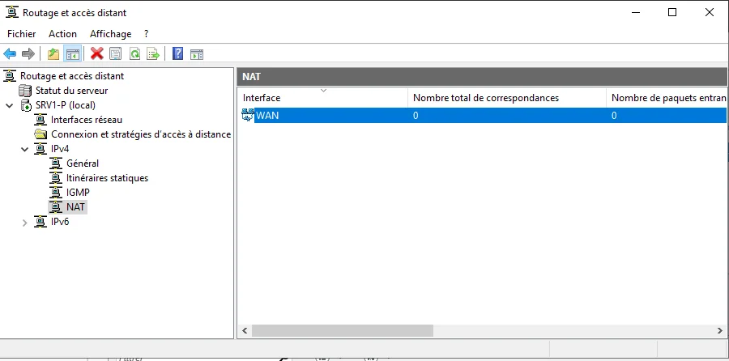
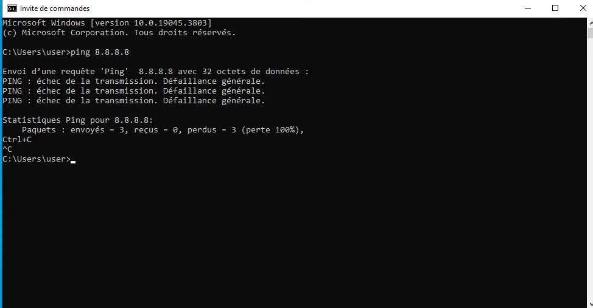
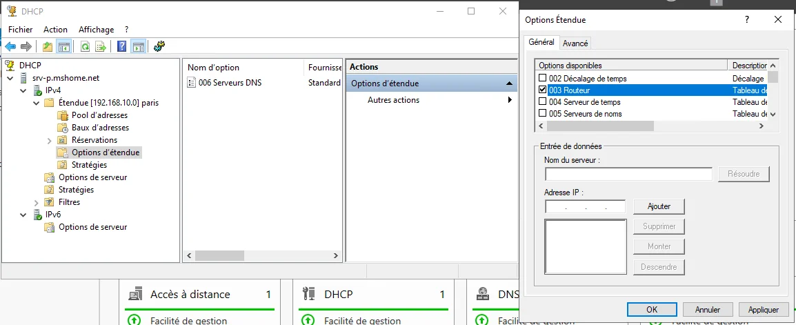
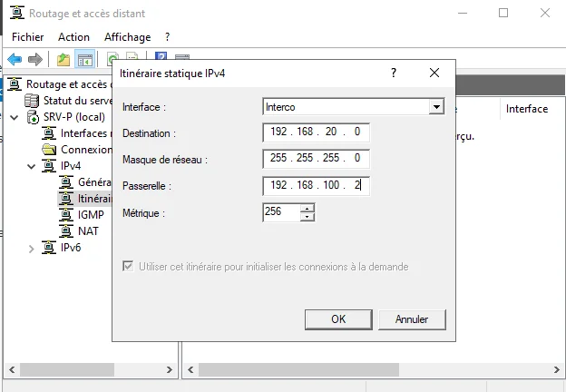

On installe l'accès à distance (remote access)

Gérer > outils > routage et accès à distance

Configuration custom :

On active le routage NAT : 

On renomme ses cartes réseau

Deux cas possibles pour cette erreur : pas de passerelle par défaut ou doublon sur le réseau.

----
Refaire le serveur de 0 pour s'entraîner.

----

## Commandes utilisées

`nslookup`
`ipconfig /all`
`ipconfig /renew`
`ipconfig /release`

----
## Après midi : interco

SRVP : 

On ping sur le client 1, Win10, le serveur SRV-M : 192.168.20.253

