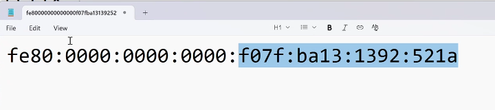
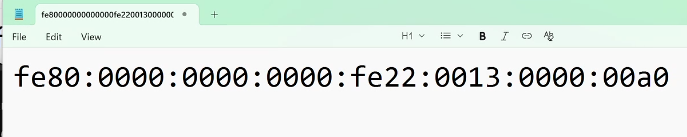
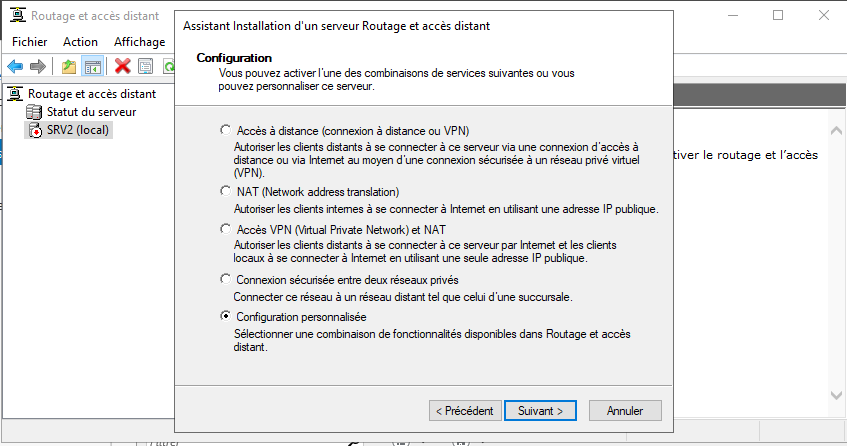
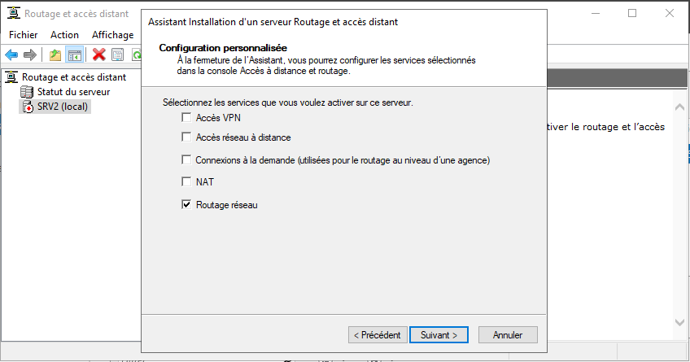
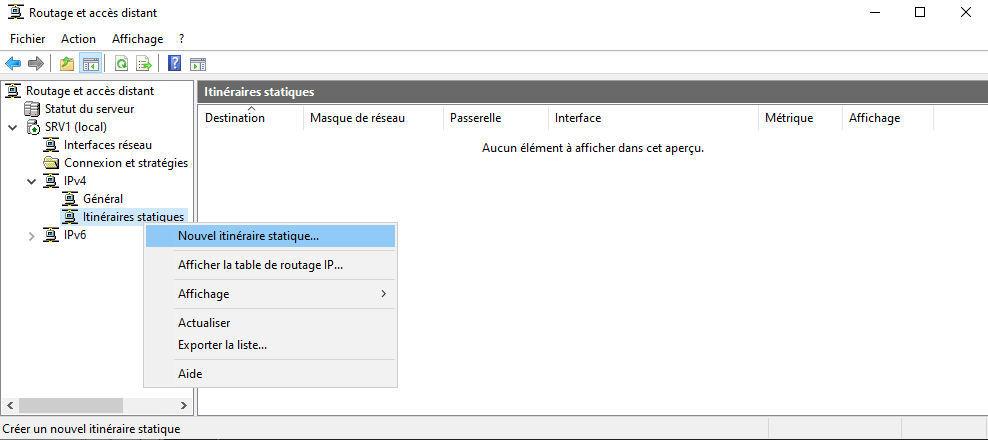
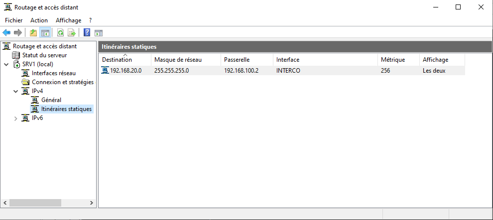
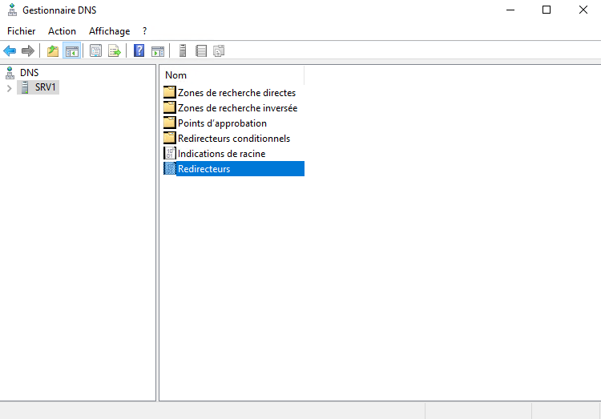
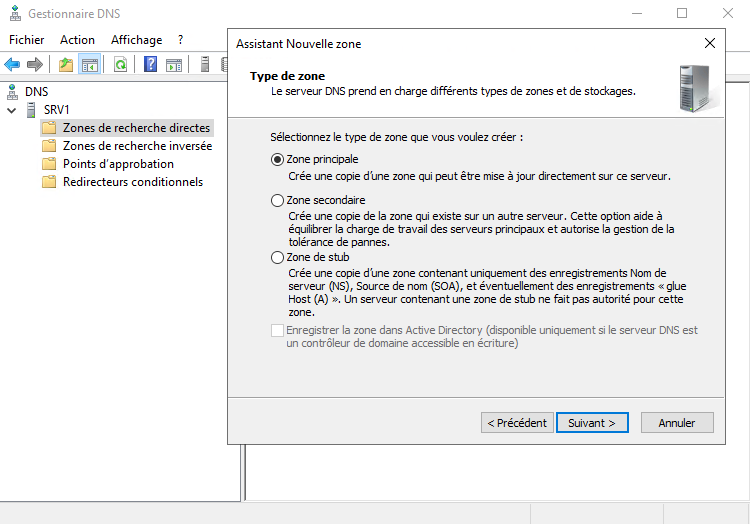
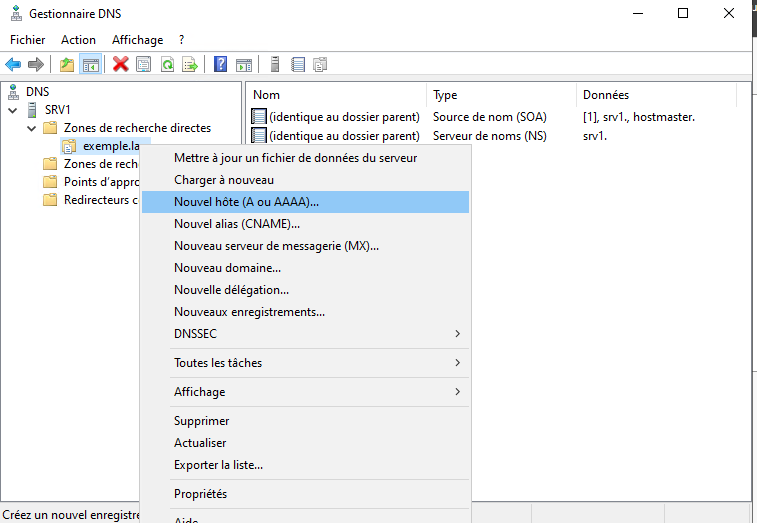

## Powershell

### Création de VM sur HyperV

```powershell
$csv = import-csv -Path "C:\hv\vms.csv" -Delimiter "," -Encoding UTF8
# Importe le CSV

$csv | ForEach-Object {
    # Lis le fichier csv et attribue une variable à chaque colonne
    $nom = $_.nom
    $ram = $_.ram + "MB"
    $type = $_.type
    $switch = $_.switch
	
	# Assigne la variable $master en fonction de la colonne "type"
    if($type -eq "S"){$master = "mastersrv1"}
    if($type -eq "C"){$master = "mastercli1"}

	# Crée un disque enfant (-differencing) à partir du master
    New-VHD -Path "C:\HV\vhds\$nom.vhdx" -ParentPath "C:\HV\masters\$master.vhdx" -Differencing

    # Vérifie si "switch" est non-vide
    if(-not($switch -eq "")){
        # Si la case "switch" est remplie, et qu'il n'existe pas déjà, on crée un switch privé
        if(-not((Get-VMSwitch).Name -eq $switch)){New-VMSwitch -Name $switch -SwitchType Private}
        # Crée la VM à partir du disque enfant créé, en précisant la RAM et le switch auquelle elle est branchée.
        New-VM -Name $nom -VHDPath "C:\HV\vhds\$nom.vhdx" -MemoryStartupBytes (Invoke-Expression $ram) -Path "C:\HV\vms\" -Generation 2 -SwitchName $switch
    }else{
	    # Crée la VM à partir du disque enfant créé, sans switch branché.
        New-VM -Name $nom -VHDPath "C:\HV\vhds\$nom.vhdx" -MemoryStartupBytes (Invoke-Expression $ram) -Path "C:\HV\vms\" -Generation 2
    }
    # Démarre la VM
    Start-VM -Name $nom
}
```


**Modules** :

Etant donné que l'on utilise un master que l'on a sysprep, on doit utiliser l'emplacement des modules qui ne dépends pas d'un user.

On vois l'emplacement des modules comme ceci : 

```powershell
$env:PSModulePath
```

Résultat de la commande : 
```
C:\Users\Stagiaire\Documents\WindowsPowerShell\Modules;C:\Program Files\WindowsPowerShell\Modules;C:\Windows\system32\WindowsPowerShell\v1.0\Modules
```

On conserve donc :
```
C:\Program Files\WindowsPowerShell\Modules;
C:\Windows\system32\WindowsPowerShell\v1.0\Modules
```

> [!NOTE]  Préparation de masters
> Si on veut que les paramètres liés à l'utilisateur comme les programmes épinglés à la barre des tâches ou l'affichage des fichiers cachés soient conservés après un sysprep, il faut aller dans l'éditeur de registre (regedit)


## IPv6

- Codé sur 128 bits
- En hexadécimal

C'est le préfixe qui nous permet d'identifier les adresses IPv6 (le premier block).

4,3 milliards d'adresses IPv4 contre des hexillions pour l'IPv6. On en arrivera difficilement à bout.


| Nom                                             | IPv6                 |
| ----------------------------------------------- | -------------------- |
| Loopback                                        | ::1/128              |
| Adresse lien locale (équivalent apipa)          | fe80::               |
| adresse de lien uniques (comm inter-entreprise) | fc00::/7<br>fd00::/7 |
| adresse routables sur internet                  | 2000::/3             |
| multicast                                       | ff00                 |



Les 4 premiers blocks appartiennent par convention au réseau, et les 4 derniers blocks appartiennent à la machine (donc le masque est /64 par défaut).




| 0    | 0    | a    | 0    |
| ---- | ---- | ---- | ---- |
| 0000 | 0000 | 1010 | 0000 |
- On ne peut pas supprimer les 0 **après** une information car ça change la valeur en hexa.
- On peut supprimer les 0 **avant** sans risques.
- Dans un block, on peut réduire les chiffres au minimum en supprimant les 0 avant

### Exos - Réduire les adresses

```
2001:0db8:0000:0000:0000:ff00:0042:8329

fe80:0000:0000:0000:0202:b3ff:fe1e:8329

2001:0db8:0000:0000:0000:0000:0000:0001

2404:6800:4004:0800:0000:0000:0000:200e

fd00:0000:0000:0000:abcd:0000:0000:1234
```

Correction :
```
2001:db8::ff00:42:8329
fe80::202:b3ff:fe1e:8329
2001:db8::1
2404:6800:4004:800::200e
fd00::abcd:0:0:1234
```


#### Transformer une adresse MAC en IPv6 (méthode EUI-64 modifiée)

On utilise la méthode EUI64 modifiée afin de créer des adresses ipv6 uniques pour chaque machines.
```
CLI1

On récupère l'adresse MAC du poste :
00-15-5D-DD-2D-0F

On sépare la MAC en octets: 00:15:5D:DD:2D:0F
00:15:5D:DD:2D:0F

Insérer FF:FE au milieu pour former l'identifiant de 64 bits:
00:15:5D:FF:FE:DD:2D:0F

Inverser le bit U/L (le 7e bit du premier octet) : 
pour 00 (00000000) → 02 (00000010)

Grouper en hextets pour l'interface ID:
0215:5DFF:FEDD:2D0F

on rajoute le préfixe fd00
fd00::215:5DFF:FEDD:2D0F
```

### Définitions

**Nat** : Network Adresse Translation = transforme une adresse en une autre adresse pour la router sur internet. Permet de protéger le réseau local, mais c'est aussi une nécessité 
**multicast** : permet de distribuer un paquet à un groupe de machines
**anycast** : équivalent du multicast, sauf que c'est une sorte de relais, chaque machine passe le relais à la suivante


### Notes du prof

Préfix :
2000::/3   -routable sur le net
fc00::/7   -Adresses locales uniques
fe80::/10  -adresses locales de lien
ff00::/8   -adresses multicast
::1/128 loopback

Multicast : permet de distribuer un paquet à un groupe de machines.
Anycast : permet de distribuer un paquet à un groupe de machines cependant,
les paquets de données ne sont pas envoyés à tous les membres du groupe anycast
mais seulement à l’appareil le plus proche

https://www.ionos.fr/digitalguide/serveur/know-how/quels-sont-les-avantages-de-ipv6/
https://www.it-connect.fr/chapitres/ipv6-normes-et-definitions/


## DNS Avancé

### Mise en place de l'infrastructure

On mets en place cette infrastructure :

| Nom  | IP             | Réseau    |
| ---- | -------------- | --------- |
| CLI1 | 192.168.10.10  | LAN PARIS |
| SRV1 | 192.168.10.110 | LAN PARIS |
| SRV1 | 192.168.100.1  | INTERCO   |
| SRV2 | 192.168.100.2  | INTERCO   |
| SRV2 | 192.168.20.120 | LAN LENS  |
| CLI2 | 192.168.20.10  | LAN LENS  |


> [!WARNING] Attention
> Ne pas oublier de faire une règle de pare-feu pour ouvrir l'ICMPv4 sur chacune des machines, afin de pouvoir faire des tests avec des pings.


On active le rôle accès à distance pour mettre en place le routage statique.










### Configuration du DNS

Les "DNS forwarders" ou "DNS Redirecteurs" : il a pour but principal déléguer la résolution des noms (par ex. example.com) à un autre serveur DNS au lieu de résoudre directement à partir de la racine ou du cache local.



Différents enregistrements DNS : 

**A** : nom vers IP = Associe un nom de domaine à une adresse IPv4. C'est l'un des enregistrements les plus fondamentaux.
**AAAA** : nom vers IPv6 = Similaire à l'enregistrement A, mais pour les adresses IPv6.
**SRV** : services spécifiques = Spécifie des ports pour des services spécifiques, souvent utilisé pour des applications comme la VoIP.
**CNAME** : alias, du nom vers nom = Crée un alias pour un domaine, redirigeant vers un autre domaine sans fournir d'adresse IP.
**MX** : serveurs de messagerie = Définit les serveurs de messagerie pour un domaine, essentiel pour la gestion des emails.
**NS** : Nameserver. Indique les serveurs de noms qui ont des droits de lecture / duplication sur un domaine. (responsables d'un domaine ?) 
**PTR** : pointeur, IP vers nom = Les enregistrements DNS PTR sont utilisés dans les recherches DNS inversées. Il s'agit d'une requête qui part de l'adresse IP et recherche le nom de domaine.
**SOA** : Start of Authority : Liste le serveur qui a les plein pouvoirs sur la zone. Contient des informations administratives sur une zone DNS, comme le serveur principal et les délais d'expiration.


Différents types de zones : 



Par mesure de sécurité, on ne crée pas de mise à jour dynamiques, sauf si la zone est intégrée à un Active Directory.


On crée un host (A) pour chacune des machines.




On renseigne la zone secondaire dans "serveurs de noms" et "transferts de zone"


### Installation d'un serveur DNS en powershell

On désinstalle le rôle DNS sur le serveur en interface graphique.

```powershell
# Sur srvP :
# Installation du rôle DNS
Install-WindowsFeature -Name DNS -IncludeAllSubFeature -IncludeManagementTools

# Ajout d'une zone primaire
Add-DnsServerPrimaryZone -Name "powershell.lan" -ZoneFile "powershell.lan.dns"

# Afficher les zones
Get-DnsServerZone

# Ajout des enregistrements DNS A des 4 machines
Add-DnsServerResourceRecordA -ZoneName "powershell.lan" -Name srvp -IPv4Address 192.168.10.110
Add-DnsServerResourceRecordA -ZoneName "powershell.lan" -Name srvl -IPv4Address 192.168.20.120
Add-DnsServerResourceRecordA -ZoneName "powershell.lan" -Name clip -IPv4Address 192.168.10.10
Add-DnsServerResourceRecordA -ZoneName "powershell.lan" -Name clil -IPv4Address 192.168.20.10

# Afficher les enregistrements DNS
Get-DnsServerResourceRecord -ZoneName "powershell.lan"

# Sur srvL : 
# Installation du rôle DNS
Install-WindowsFeature -Name DNS -IncludeAllSubFeature -IncludeManagementTools

Add-DnsServerSecondaryZone -Name "powershell.lan" -ZoneFile "powershell.lan.dns" -MasterServers 192.168.100.1

# Afficher les zones - elle a bien été ajoutée
Get-DnsServerZone

# Sur srvP :
Set-DnsServerPrimaryZone -Name powershell.lan -SecondaryServers 192.168.100.2 -SecureSecondaries TransferToSecureServers 

```


