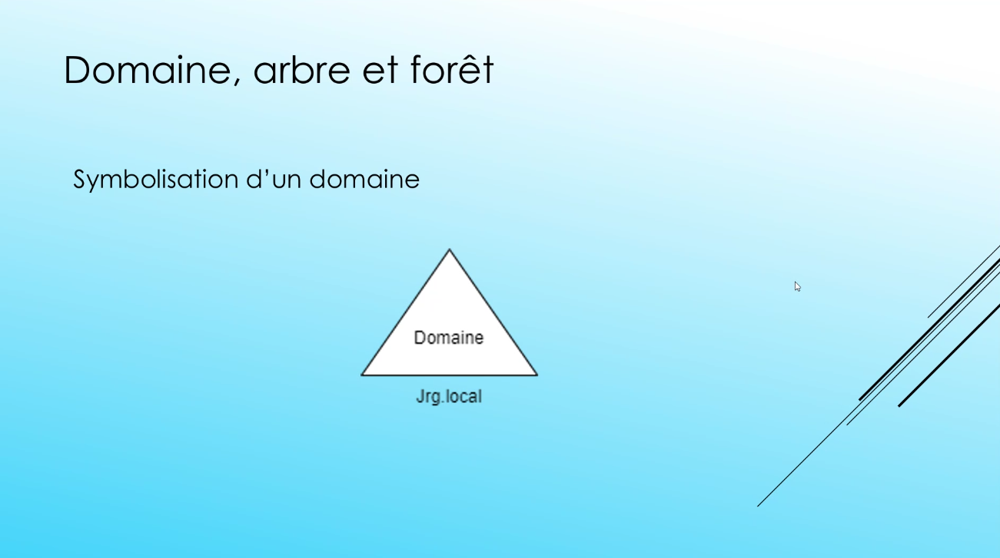
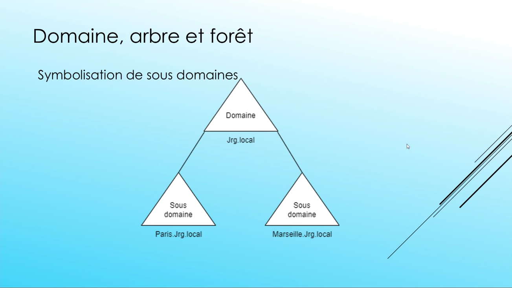
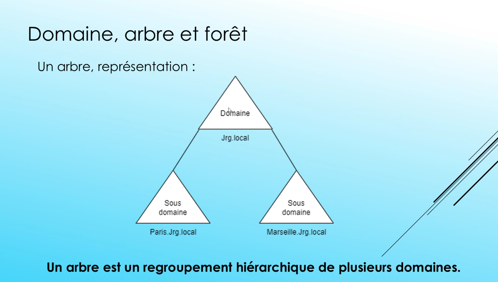
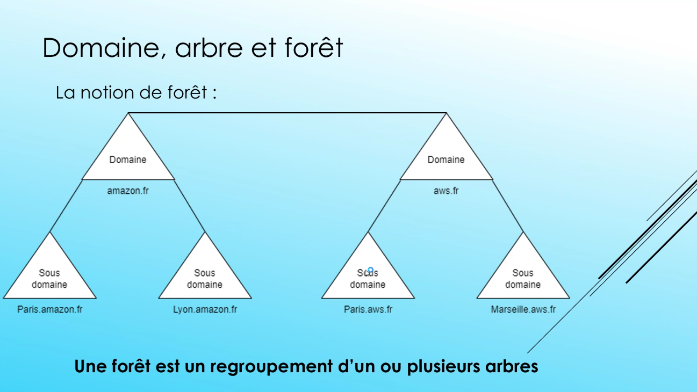
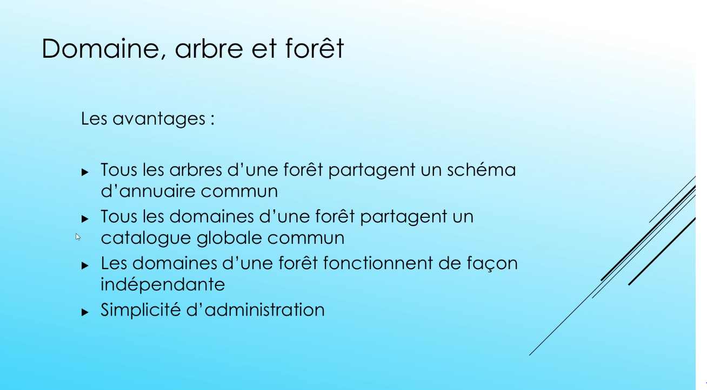
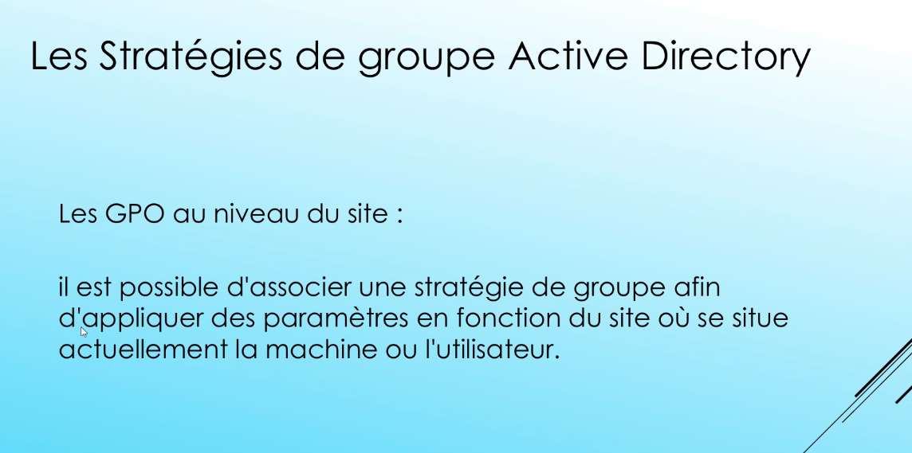
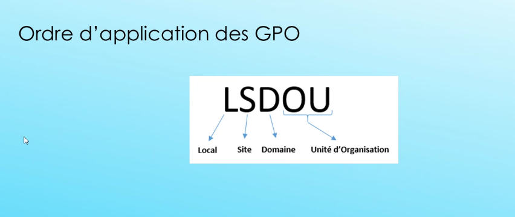
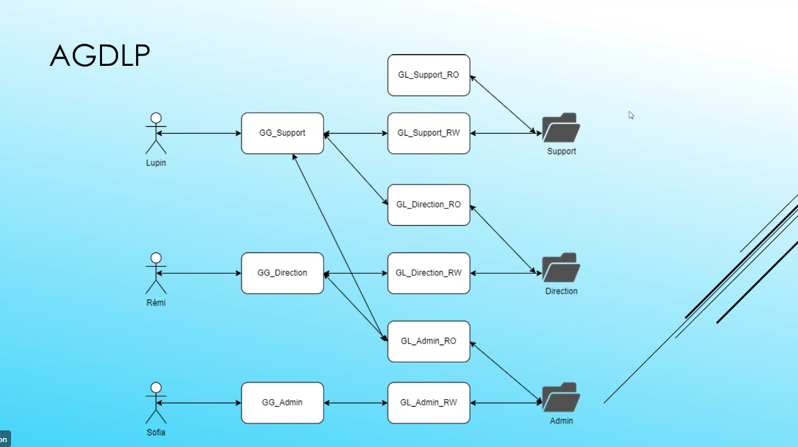

# Active Directory

Slides : [MODULE_ADGPO](Admin1_2/MODULE_ADGPO.pdf)

Schéma Active Directory
- Classes
- Attributs

Il est très vivement déconseillé de modifier le schéma Active Directory.
Il sers à contenir les informations sur les types d'objets et les attributs des utilisateurs.

La structure de l'AD
- Partitions d'annuaires
	- Partition de Schéma
	-  de domaine
	- de configuration

Groupe de travail et domaine
Workgroup : 
- Base d'utilisateurs par machine (base SAM)

Contrôleur de domaine :
- Le serveur qui crée le domaine est par défaut le contrôleur de domaine.
- Doit être accessible en permanence

Deux types de groupes : 
- Sécurité -> les accès
	- Groupe domaine local -> n'existe que dans le domaine local
	- Groupe global -> s'applique sur un arbre
	- Universel -> englobe toute la forêt
- Distribution -> mail

Stratégies de groupe.
GPO

L'ordre de priorité des GPO dépends de la position géographique de la GPO. Le plus proche va s'appliquer en premier.

AGDLP
Account Global Domain Local Permissions

Utilisateur 
Groupe Global
Groupe domaine local (GDL) lecture écriture

RO = Read Only
RW = Read Write

## TP

- Installer le serveur AD en mode graphique

