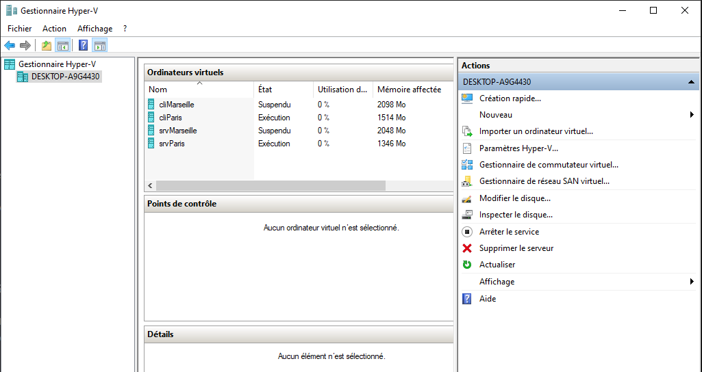
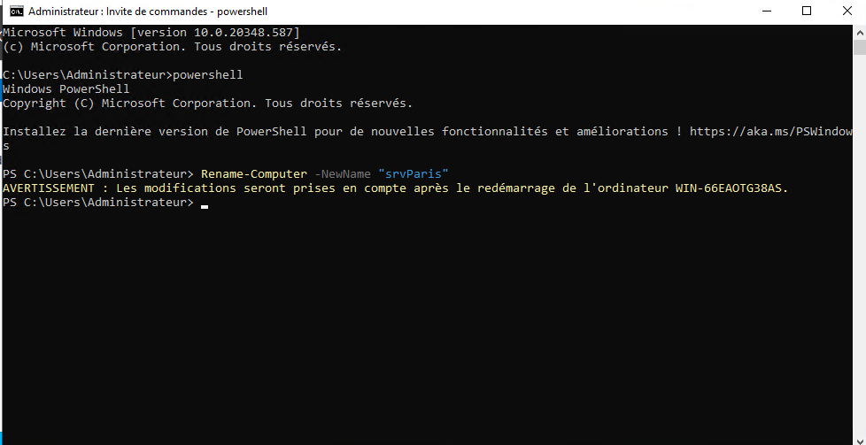

## SRV + Powershell

[TP SRV + POWERSHELL](20251024_TP1/TP%20SRV%20+%20POWERSHELL.docx)

### 1. Création des machines

Créez les machines suivantes :
-SRV Paris -> switch paris (privé)
-SRV Marseille -> switch Marseille (privé)
-Client Paris -> switch paris (privé)
-Client Marseille -> switch Marseille (privé)



### 2. Configuration de base des machines

Renommez les deux serveurs en utilisant POWERSHELL.

```powershell
Rename-Computer -NewName "srvParis"
```



```powershell
Rename-Computer -NewName "srvMarseille"
```


Renommez la carte réseau des serveurs en "LAN" (SANS POWERSHELL) et mettez les IP suivantes :
-SRV Paris : 192.168.100.254/24
-SRV Marseille : 192.168.200.254/24 

Ajoutez une seconde carte réseau pour les deux serveur (carte interco) et donnez les ip suivantes (SANS POWERSHELL):
-SRV Paris : 192.168.250.1
-SRV Marseille : 192.168.250.2
 


### 3. Installation et Configuration du DHCP sur le serveur Paris

VIA POWERSHELL Ajoutez le rôle DHCP sur le serveur Paris et configurez 2 étendues :
-Etendue 1 
Nom : Paris Lan
Adresse de début : 192.168.100.10
adresse de fin : 192.168.100.20
Routeur : 192.168.100.254
DNS : 8.8.8.8
 
-Etendue 2 
Nom : Marseille Lan
Adresse de début : 192.168.200.10
adresse de fin : 192.168.200.20
Routeur : 192.168.200.254
DNS : 8.8.8.8
 
Testez le DHCP sur le client paris.
 
### 4. Installation et configuration du routage sur les deux serveurs (SANS POWERSHELL) :
 
Sur le serveur Paris :
 
-Installez le Rôle Accès à distance (sélectionnez routage dans fonctionnalités du rôle)
-Configurez le routeur pour du routage réseau
-dans routage et acces distant créez la route statique suivante :
interface : interco
destination : 192.168.200.0
Passerelle : 192.168.250.2
 
Sur le serveur Marseille :
 
-Installez le Rôle Accès à distance (sélectionnez routage dans fonctionnalités du rôle)
-Configurez le routeur pour du routage réseau et du NAT
-dans routage et acces distant créez la route statique suivante :
interface : interco
destination : 192.168.100.0
Passerelle : 192.168.250.1
Testez la connexion entre client paris et le serveur Marseille
 
### 5 - Configuration de l'agent relai DHCP (SANS POWERSHELL)
 
Sur le serveur Marseille dans routage et acces à distance 
Clique droit sur générale -> nouveau protocole de routage et sélectionnez DHCP agent relay
Dans l'agent relai ajoutez la carte lan puis indiquez dans les propriétés l'IP du serveur Paris.
 
Vérifiez que le client Marseille obtient bien une IP
 
### 6 - configuration du NAT (SANS POWERSHELL) :

Sur le serveur Marseille ajoutez une nouvelle carte réseau default switch
Renommez la "WAN"
Dans  routage et accès distant clic droit sur NAT -> nouvelle interface et sélectionnez "WAN"
Vérifiez que le client Marseille accède à internet
 
Sur le serveur Paris configurez la route par défaut
Vérifiez que le client paris accède à internet.

### BONUS

Continuez la configuration du script que nous avons commencé la semaine dernière !

